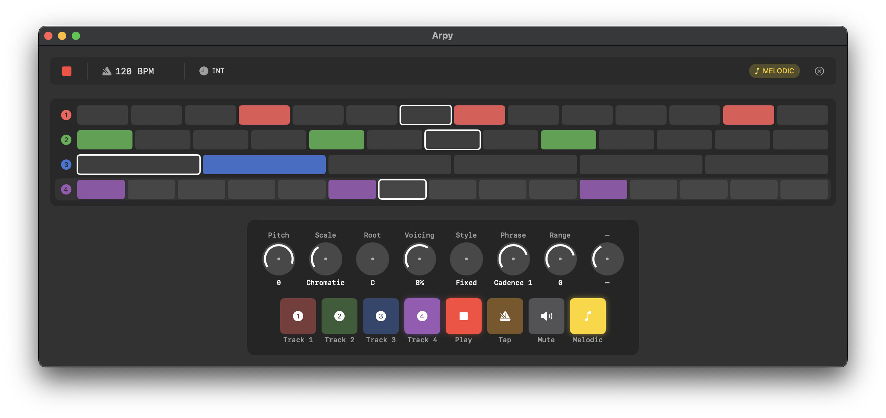

<p align="center">
  <h1 align="center">Arpy</h1>
  <p align="center">
    <strong>Euclidean Sequencer for macOS</strong>
    <br />
    <em>Algorithmic rhythm generation · MIDI output · Hardware controller support</em>
  </p>
</p>

<br />

<p align="center">
  
</p>

<br />

## What is this?

Arpy is a native macOS sequencer that generates [Euclidean rhythms](https://en.wikipedia.org/wiki/Euclidean_rhythm) — an algorithm that distributes beats as evenly as possible across a pattern. Think Cuban tresillo, West African bell patterns, and bossa nova — all described by a simple formula.

```
8 steps, 3 pulses  →  X · · X · · X ·      (tresillo)
8 steps, 5 pulses  →  X · X X · X X ·      (cinquillo)
16 steps, 5 pulses →  X · · X · · X · · X · · X · · ·  (bossa nova)
```

It outputs MIDI to a virtual port — connect it to your DAW, hardware synths, or anything that speaks MIDI.

---

## Features

| | |
|---|---|
| **4 independent tracks** | Each with its own pattern, pitch, velocity, and MIDI channel |
| **Euclidean engine** | Bjorklund's algorithm with step count, pulse count, and rotation |
| **Melodic control** | Scale quantization, transpose, phrase shapes, voicing styles |
| **Repeats / ratchets** | Per-track note repeats for rolls and fills |
| **Tap tempo** | Tap to set BPM on the fly |
| **Virtual MIDI output** | Shows up as "Arpy Sequencer" in any DAW |
| **AKAI LPD8 MKII** | Plug-and-play hardware controller mapping |
| **Keyboard shortcuts** | `Space` play/stop · `1-4` track select · `M` mute · `Shift` melodic mode |
| **State persistence** | Saves and restores your session automatically |

---

## Knob Layout

**Normal mode** — rhythm and timing:

| Knob | Function | Range |
|:----:|----------|-------|
| 1 | Steps | 1–16 |
| 2 | Pulses | 0–16 |
| 3 | Rotate | 0–15 |
| 4 | Division | 1/1 to 1/32 |
| 5 | Repeats | 0–8 |
| 6 | Velocity | 1–127 |
| 7 | Sustain | 1–100% |
| 8 | Tempo | 40–240 BPM |

**Melodic mode** (hold `Shift` or Pad 8) — pitch and harmony:

| Knob | Function | Range |
|:----:|----------|-------|
| 1 | Pitch | −24 to +24 semitones |
| 2 | Scale | Chromatic, Major, Minor, Pentatonic, … |
| 3 | Root Note | C through B |
| 4 | Voicing | 0–100% |
| 5 | Style | Fixed, Ramp, Climb |
| 6 | Phrase | Cadence 1–4, Saw, Tri, Sine, Pulse |
| 7 | Range | −3 to +3 octaves |

---

## Getting Started

### Requirements

- macOS 14.0 (Sonoma) or later
- Xcode 15+
- [XcodeGen](https://github.com/yonaskolb/XcodeGen) (for project generation)

### Build & Run

```bash
brew install xcodegen
xcodegen generate
open Arpy.xcodeproj
```

Then hit `⌘R` in Xcode — or build from the command line:

```bash
xcodebuild -scheme Arpy -configuration Debug build
```

### Connect to a DAW

1. Launch Arpy
2. In your DAW, look for a MIDI input called **Arpy Sequencer**
3. Create 4 MIDI tracks on channels 1–4
4. Press `Space` to play

---

## Hardware Controller

Arpy is designed for the **AKAI LPD8 MKII** (default Program 1 mapping):

- **Pads 1–4** → Track select
- **Pad 5** → Play/Stop
- **Pad 6** → Tap tempo
- **Pad 7** → Mute
- **Pad 8** (hold) → Melodic shift mode
- **Knobs 1–8** → CC 1–8, mapped to current mode parameters

The controller is auto-detected on connect.

---

## Architecture

```
SwiftUI Views
    │
    ▼
SequencerViewModel          ← all state mutation
    │
    ▼
Functional Core             ← pure, testable, no side effects
├── EuclideanEngine         Bjorklund's algorithm
├── MIDIEngine              Note/message generation
├── ScaleEngine             Pitch quantization
├── PhraseEngine            Melodic modulation
├── RepeatEngine            Ratchet computation
└── ClockEngine             High-precision timing
```

---

## License

MIT
